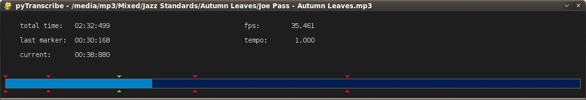

## Summary

pyTranscribe is a minimalistic audio player providing features which simplify transcribing music (pitch shifting, precise fast forward/rewind, markers). 

**Features:**

- gstreamer based
- supported file types: everything supported by gstreamer (mp3, ogg, videos, ...)
- constant pitch tempo adjustment
- precise/quick seeking (works for videos too)
- position marker system
- simple keyboard controls
- responsive user interface due to pygame 

Moved from: [code.google.com/p/pytranscribe](code.google.com/p/pytranscribe)

## Installation

It's just a python script: [download](https://raw.githubusercontent.com/bluenote10/pytranscribe/master/pyTranscribe.py)

**Note:** Installation instructions last verfying for Ubuntu 14.04.

Besides python you must have installed:

- gstreamer
- scaletempo/pitch plugins for gstreamer
- python bindings for gstreamer
- pygame 

If you're running Ubuntu 9.04 or later this means you'll have to install these packages:

- `gstreamer0.10-plugins-bad`
- `python-gst0.10`
- `python-pygame`

Ubuntu 8.04/8.10 versions of gstreamer0.10-plugins-bad do not contain the required scaletempo/pitch plugins so you'll have to compile it manually.

## Usage

Start with:

    pyTranscribe.py <filename>

Keyboard Controls:

    LEFT/RIGHT -> seek
    BACKSPACE  -> seek to active marker (the green one) and start playing if paused
    HOME       -> seek to 00:00:000
    SPACE      -> pause/play
    +/-        -> adjust tempo in 12-root(2) steps
    F5-F10     -> set tempo to 50% - 100%
    b          -> toggle scaletempo bypass
    m          -> create new marker at current position
    d          -> delete active marker
    <ALT> +/-  -> precisely move active marker
 
The only implemented mouse control is: LEFTMOUSEBUTTON in progress bar -> seek

